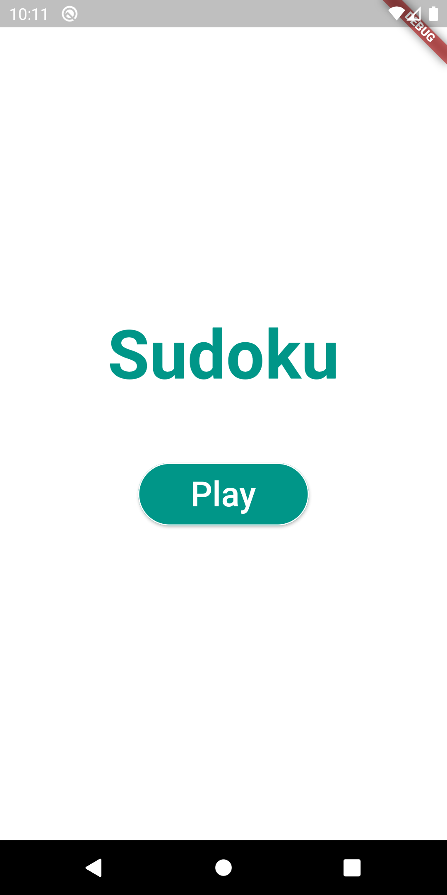
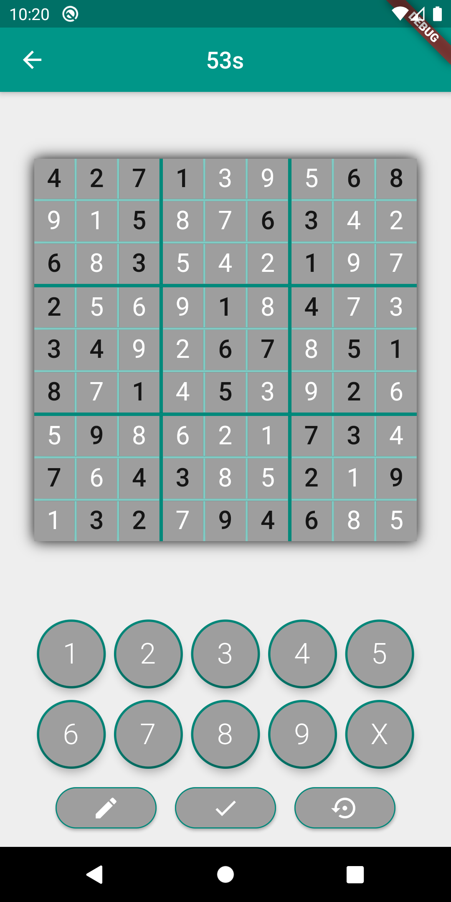
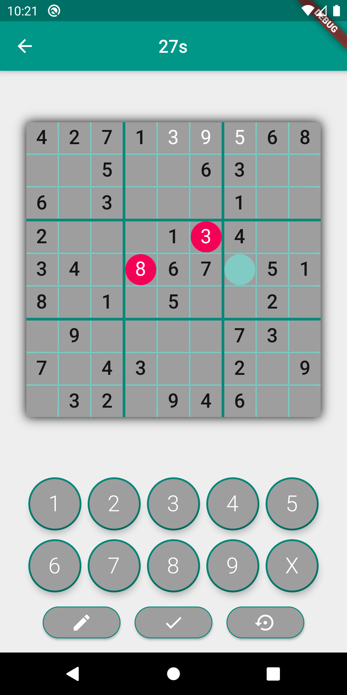

# sudoku

Sudoku is a simple sudoku game developed with Flutter. The object of this project was to get confortable with with the framwork and its basic concepts. Therefore, there is only one sudoku, which is enough to the project porpouse. 

## Game features
* Visual and automatic resolution
* Error checking
* Game clock
* Animations to show the selected board cell

## Images

